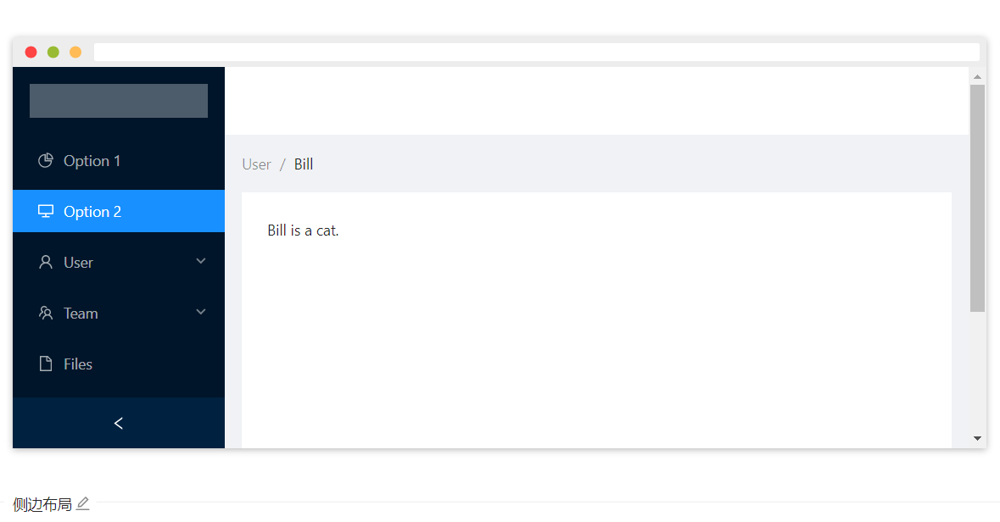
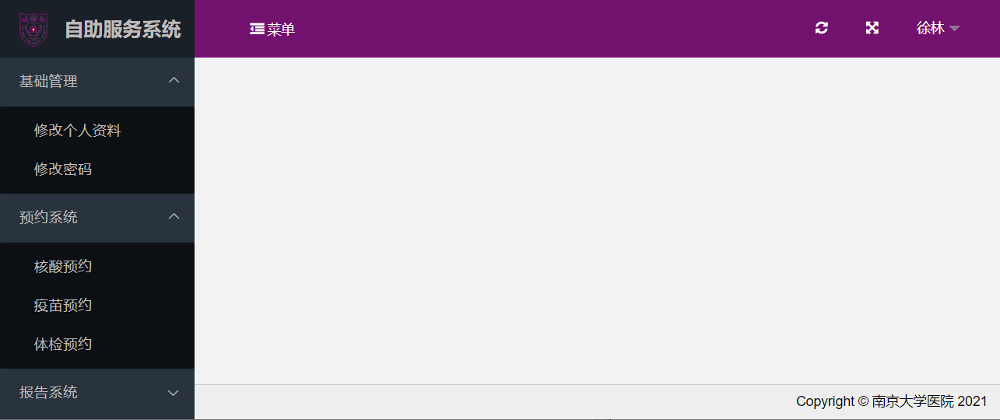

##  南大测试信息网站

#### 1.网页端与移动端的界面布局

​	①网页端的布局参考ant design的文档中的侧边布局

[侧边布局链接]: https://ant.design/components/layout-cn/#components-layout-demo-side

​	将已经完成的首页、资质查看等按钮移至侧边栏，侧边栏的按钮可以点击后下拉显示按钮的细节，比如新闻资讯按钮的下拉菜单中有（通知通告、中心新闻、行业新闻、技术交流）

[下拉菜单链接]: https://ant.design/components/dropdown-cn/

​	网站的右上角显示当前用户的用户名，可以参考下图

②移动端的布局虽然有现成的ant design mobile，但它是android开发，可能有一定的学习成本，我的想法是在网页的最底端添加两个按钮 网页端|移动端 

​	根据用户的选择提供符合两种屏幕大小的网页

------

## 用户，工作人员，管理员

​	①用户：在信息网站，可以访问的功能是**业务信息**模块中的**进展查询**和**委托申请**

​    ②工作人员：包括市场部人员，测试人员，质量部人员，功能在在线web应用

​    ③管理员：拥有工作人员的**所有功能**，可以管理工作人员的权限

------

## 南大测试在线web应用

#### 1.页面布局

​	参考ant design的文档中的侧边布局

​	

[侧边布局链接]: https://ant.design/components/layout-cn/#components-layout-demo-side

​	左边的侧边栏是当前登录人员的功能模块，点击后有下拉菜单，下拉菜单中是当前模块的细节。右上角显示当前登录人员的用户名和身份，参考下图

#### 2.工作人员权限

​	（加粗的是按钮，冒号后面的是点击按钮后显示的下拉菜单中的内容）

[下拉菜单链接]: https://ant.design/components/dropdown-cn/

​	①市场部人员：

​		**委托管理**：委托查询，委托审批

​		**合同管理**：合同查询，合同审批，合同修改，合同删除

​		**报告管理**：报告查询，报告审批

   ②测试人员：

​		**样品管理**：样品查询，样品接收，测试方案生成

   ③质量部人员：

​		**方案审批**：测试方案审批

#### 3.管理员权限

​	①有以上工作人员的所有权限

​	②**工作人员管理**：工作人员创建，工作人员查询，工作人员权限变更

按照上面的细节设计在线web应用的网页